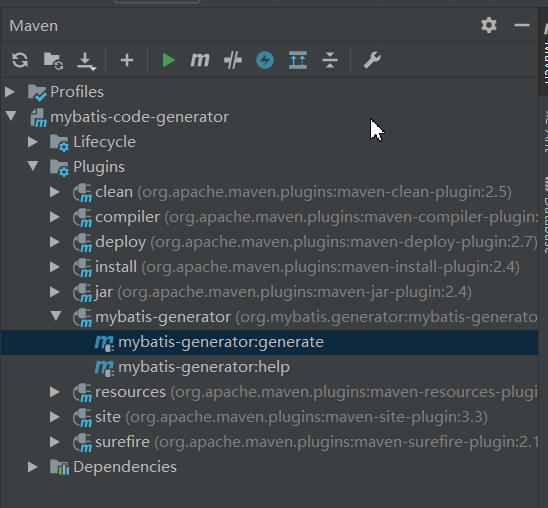

# mybatis-code-generator
mybatis代码生成

## 使用方法

- 拉取项目
```$xslt
git clone https://github.com/Wanzhk/mybatis-code-generator.git
```

- 配置数据源
>路径：`resource/jdbc.properties`
```xml
jdbc.driverClass=com.mysql.cj.jdbc.Driver
jdbc.connectionURL=jdbc:mysql://127.0.0.1:3306/blog?useSSL=false&characterEncoding=utf8&serverTimezone=GMT%2B8
jdbc.username=root
jdbc.password=admin
```

- 配置生成规则
> 路径：`resource/generator/generatorConfig.xml`
```xml
<?xml version="1.0" encoding="UTF-8"?>
<!DOCTYPE generatorConfiguration
        PUBLIC "-//mybatis.org//DTD MyBatis Generator Configuration 1.0//EN"
        "http://mybatis.org/dtd/mybatis-generator-config_1_0.dtd">

<generatorConfiguration>
    <!-- 1、引入数据库连接配置 -->
    <properties resource="jdbc.properties"/>

    <context id="Mysql" targetRuntime="MyBatis3Simple" defaultModelType="flat">
        <!-- 2、处理sql中的`符号 -->
        <property name="beginningDelimiter" value="`"/>
        <property name="endingDelimiter" value="`"/>

        <!-- 3、添加自定义的继承接口MyMapper -->
        <plugin type="tk.mybatis.mapper.generator.MapperPlugin">
            <property name="mappers" value="tk.mybatis.mapper.MyMapper"/>
        </plugin>

        <!-- 4、配置数据库连接 [勿动] -->
        <jdbcConnection
                driverClass="${jdbc.driverClass}"
                connectionURL="${jdbc.connectionURL}"
                userId="${jdbc.username}"
                password="${jdbc.password}">
        </jdbcConnection>

        <!-- 5、配置实体类生成路径 [targetPackage:填写代码实际包路径] -->
        <javaModelGenerator targetPackage="com.wanzhk.generator.entity" targetProject="src/main/java"/>

        <!-- 6、配置 XML 生成路径 -->
        <sqlMapGenerator targetPackage="mapper" targetProject="src/main/resources"/>

        <!-- 7、配置 Mapper 生成路径 [targetPackage:填写代码实际包路径] -->
        <javaClientGenerator
                targetPackage="com.wanzhk.generator.mapper"
                targetProject="src/main/java"
                type="XMLMAPPER"/>

        <!-- 8、配置需要指定生成的数据库和表，tableName:指定要生成的表名，% 代表所有表，catalog表示的是数据库的名字 -->
        <table catalog="blog" tableName="%">
            <!-- mysql 配置 -->
            <generatedKey column="id" sqlStatement="Mysql" identity="true"/>
        </table>
    </context>
</generatorConfiguration>
```

- 生成

方式一：
`mvn mybatis-generator:generate`

方式二：


